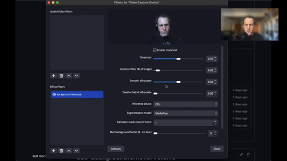

# OBS Plugin: Background Removal

- [Introduction](#introduction)
- [Building](#building)
  - [MacOSX](#mac-osx)
  - [Linux (Ubuntu, Arch)](#linux)
  - [Windows](#windows)

## Download
Check out the [latest releases](https://github.com/royshil/obs-backgroundremoval/releases) for downloads and install instructions.

## Introduction

This plugin is meant to make it easy to replace the background in portrait images and video.
It is using a neural network to predict the mask of the portrait and remove the background pixels.
It's easily composable with other OBS plugins to replace the background with e.g. an image or
a transparent color.



The models used for background detection are SINet: https://arxiv.org/abs/1911.09099 and MODNet: https://arxiv.org/pdf/2011.11961.pdf
The pre-trained model weights were taken from:
- https://github.com/anilsathyan7/Portrait-Segmentation/tree/master/SINet
- https://github.com/ZHKKKe/MODNet

Some more information about how I built it: https://www.morethantechnical.com/2021/04/15/obs-plugin-for-portrait-background-removal-with-onnx-sinet-model/

## Building

The plugin was built and tested on Mac OSX, Windows and Ubuntu Linux. Help is appreciated in building on other OSs and formalizing the one-click installers.

### Prerequisites for building
- OpenCV v4.2+: https://github.com/opencv/opencv/
- ONNXRuntime: https://github.com/microsoft/onnxruntime

### Mac OSX

#### Install dependencies

You may use homebrew:
```
$ brew install opencv onnxruntime
```

Or - you may also build a (very minimal) version of OpenCV and ONNX Runtime for static-linking, instead of the homebrew ones:
```
<root>/build/ $ ../scripts/makeOpenCV_osx.sh
<root>/build/ $ ../scripts/makeOnnxruntime_osx.sh
```
Static linking should be more robust across versions of OSX, as well as building for 10.13.

#### Finding libobs

If you install the desktop OBS app (https://obsproject.com/download) you already have the binaries
for libobs (e.g. `/Applications/OBS.app/Contents/Frameworks/libobs.0.dylib`)
But you don't have the headers - so clone the main obs repo e.g. `git clone --single-branch -b 27.1.3 git@github.com:obsproject/obs-studio.git` (match the version number to your OBS install. Right now on OSX it's 27.1.3)

#### Build
```
$ mkdir -p build && cd build
$ cmake .. -DobsLibPath=/Applications/OBS.app/Contents/Frameworks -DobsIncludePath=~/Downloads/obs-studio/libobs
$ cmake --build . --target dist
$ cpack
```

#### Install
Unpack the package to the plugins directory of the system's Library folder (which is Apple's preferred way but requires admin privileges)

```sh
sudo mkdir -p "/Library/Application Support/obs-studio/plugins/obs-backgroundremoval"
sudo unzip -j obs-backgroundremoval-macosx.zip "Plugins/obs-backgroundremoval.so" -d "/Library/Application Support/obs-studio/plugins/obs-backgroundremoval/bin"
sudo unzip -j obs-backgroundremoval-macosx.zip "Resources/data/obs-plugins/obs-backgroundremoval/*" -d "/Library/Application Support/obs-studio/plugins/obs-backgroundremoval/data"
```

or directly to your OBS install directory, e.g.
```
$ unzip -o obs-backgroundremoval-macosx.zip -d /Applications/OBS.app/Contents/
```

The first is recommended as it preserves the plugins over the parallel installation of OBS versions (i.e. running the latest productive version and a release candidate), or operations like `brew upgrade obs`, whereas the latter will also remove the plugin if you decide to delete the OBS application.

### Linux

#### Ubuntu

```
$ sudo apt install -y libobs-dev libopencv-dev language-pack-en wget git build-essential cmake libsimde-dev
$ wget https://github.com/microsoft/onnxruntime/releases/download/v1.7.0/onnxruntime-linux-x64-1.7.0.tgz
$ sudo tar xzvf onnxruntime-linux-x64-1.7.0.tgz --strip-components=1 -C /usr/local/ --wildcards "*/include/*" "*/lib*/"
```

Clone this repo into a directory of your choice, then build and install, e.g.:
```
$ cd obs-backgroundremoval
$ mkdir build && cd build
$ cmake .. && cmake --build . && sudo cmake --install .
```

To build with CUDA support, you will need the CUDA libraries installed as well as the GPU version of the ONNX Runtime library.

Use the instructions at [https://docs.nvidia.com/cuda/cuda-installation-guide-linux/index.html#ubuntu-installation](https://docs.nvidia.com/cuda/cuda-installation-guide-linux/index.html#ubuntu-installation) to set up the NVIDIA Cuda repository, then:

> These instructions use the 1.9.0 version of onnxruntime. If you wish to use a different version, change the export line
> to the version number you require.

```
$ export ONNX_VERSION=1.9.0
$ sudo apt install cuda libcudnn8
$ wget https://github.com/microsoft/onnxruntime/releases/download/v${ONNX_VERSION}/onnxruntime-linux-x64-gpu-${ONNX_VERSION}.tgz
$ sudo tar xzvf onnxruntime-linux-x64-gpu-${ONNX_VERSION}.tgz --strip-components=1 -C /usr/local/ --wildcards "*/include/*" "*/lib*/"
```

Then build and install:
```
$ sudo ldconfig  # required if you have previously had a different version of onnxruntime installed
$ mkdir build && cd build
$ cmake -DWITH_CUDA=ON .. && cmake --build . && sudo cmake --install .
```

If after installing, the plugin fails to load and cannot be found in the interface, there are additional steps to carry out.

```
$ mkdir -p ~/.config/obs-studio/plugins/obs-backgroundremoval/bin/64bit
$ ln -s /usr/local/lib/obs-plugins/obs-backgroundremoval.so ~/.config/obs-studio/plugins/obs-backgroundremoval/bin/64bit/
$ ln -s /usr/local/share/obs/obs-plugins/obs-backgroundremoval ~/.config/obs-studio/plugins/obs-backgroundremoval/data
```
If you wish to install this system-wide, change obs-studio path from `~/.config/obs-studio/plugins` to `/usr/share/obs/obs-plugins`.

#### Archlinux
A `PKGBUILD` file is provided for making the plugin package
```
$ cd scripts
$ makepkg -s
```

Building for Arch in Docker (host OS e.g. MacOSX):
```
$ docker pull archlinux:latest
$ docker run -it -v $(pwd):/src archlinux:latest /bin/bash
# pacman -Sy --needed --noconfirm sudo fakeroot binutils gcc make
# useradd builduser -m
# passwd -d builduser
# printf 'builduser ALL=(ALL) ALL\n' | tee -a /etc/sudoers
# sudo -u builduser bash -c 'cd /src/scripts && makepkg -s'
```

### Windows

We will use static linking (as much as possible) to aviod having to lug around .DLLs with the plugin.

#### Install Prerequisites
Install OpenCV via `vcpkg`:
```
$ mkdir build
$ cd build
$ git clone https://github.com/microsoft/vcpkg
$ cd vcpkg
$ .\bootstrap-vcpkg.bat
$ .\vcpkg.exe install opencv[core]:x64-windows-static
```

Install Onnxruntime with NuGet:
```
$ cd build
$ mkdir nuget
$ Invoke-WebRequest https://dist.nuget.org/win-x86-commandline/latest/nuget.exe -UseBasicParsing -OutFile nuget.exe
$ nuget.exe install Microsoft.ML.OnnxRuntime.DirectML -Version 1.7.0
$ nuget.exe install Microsoft.ML.OnnxRuntime.Gpu -Version 1.7.1
```

Clone the OBS repo, `Downloads\ $ git clone --single-branch -b 27.0.1 git@github.com:obsproject/obs-studio.git`, to e.g. Downloads.

#### Build and install the plugin
```
$ cmake .. -DobsPath="$HOME\Downloads\obs-studio\"
$ cmake --build . --config Release
$ cpack
$ Expand-Archive .\obs-backgroundremoval-win64.zip -DestinationPath 'C:\Program Files\obs-studio\' -Force
```

To build with CUDA support, tell cmake to use the CUDA version of OnnxRuntime
```
$ cmake .. -DobsPath="$HOME\Downloads\obs-studio\" -DWITH_CUDA=ON
```
The rest of the build process is similar, but the result archive will be
`obs-backgroundremoval-win64-cuda.zip`.
